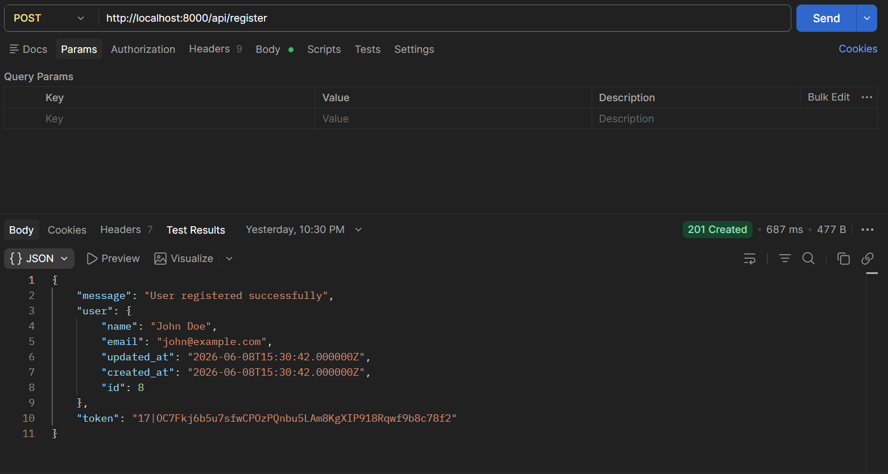
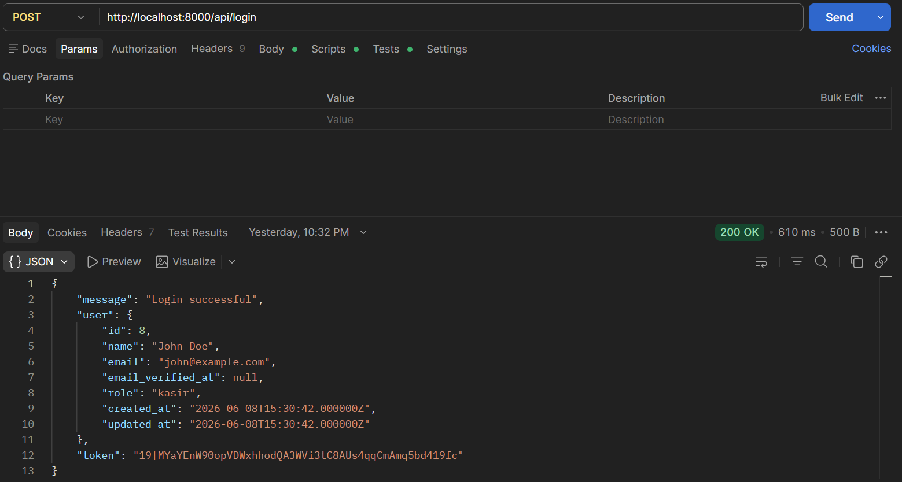
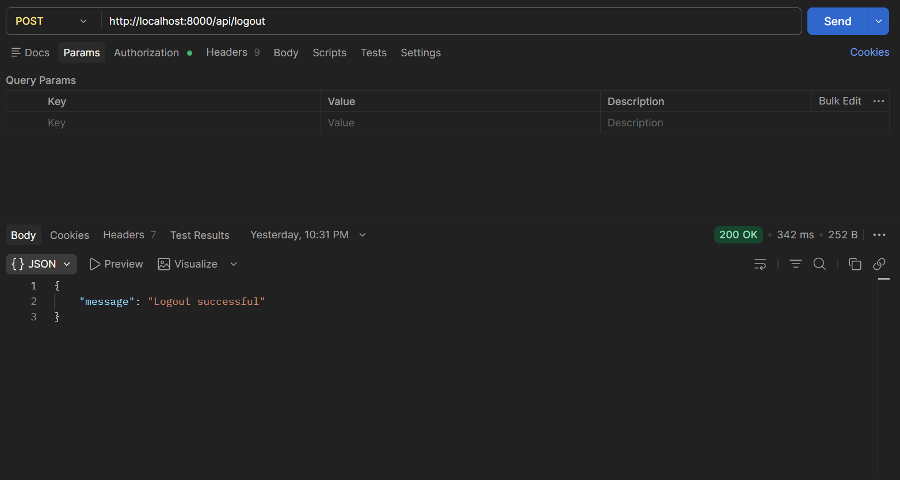

# Sistem Manajemen Laundry 

Project ini adalah Sistem Laundry berbasis **REST API** yang dibangun menggunakan **Laravel 13** dan **Laravel Sanctum**. Project ini ditujukan untuk memenuhi tugas Ujian Akhir Semester (UAS).

Aplikasi ini menerapkan sistem **Authentication**, **Role-Based Access Control (RBAC)** dengan tingkatan hak akses untuk **Admin** dan **Kasir**, manajemen relasi database, kalkulasi kembalian otomatis, perubahan status pesanan otomatis, hingga pencetakan struk pembayaran dalam format PDF.

---

## 💻 Bahasa Pemrograman yang Digunakan
- **PHP** / **JavaScript** / **Python** *(Pilih/sesuaikan dengan yang kamu gunakan)*
- **HTML5 & CSS3** (Untuk antarmuka/UI)
- **SQL** (Untuk pengelolaan database)

## 🛠️ Framework, Library, API, dkk yang Digunakan
- **Framework Web:** Laravel / CodeIgniter / Express.js *(Silakan disesuaikan)*
- **Styling & UI:** Bootstrap / Tailwind CSS
- **Database:** MySQL / MariaDB
- **Library Tambahan:** DataTables (untuk tabel), Chart.js (untuk grafik laporan), SweetAlert (untuk pop-up notifikasi)
- **API (Opsional):** WhatsApp API / gateway (Untuk mengirim notifikasi selesai ke pelanggan)

## ✨ Fungsi dan Fitur Proyek yang Dibangun
Proyek ini menyediakan fitur-fitur esensial untuk mengelola operasional laundry:
1. **Dashboard Informatif:** Menampilkan ringkasan pendapatan, jumlah pesanan, dan status cucian.
2. **Manajemen Transaksi:** Pencatatan cucian masuk, pemilihan paket, input berat, dan kalkulasi total harga otomatis.
3. **Manajemen Status Cucian:** Update status secara realtime (Baru Masuk -> Sedang Dicuci -> Sedang Disetrika -> Selesai -> Sudah Diambil).
4. **Manajemen Pelanggan:** Database pelanggan tetap untuk memudahkan pencarian saat transaksi berikutnya.
5. **Manajemen Paket & Harga:** Admin dapat mengubah, menambah, atau menghapus jenis layanan (Kiloan, Satuan, Selimut, dll).
6. **Laporan Keuangan:** Fitur filter laporan pendapatan harian, bulanan, hingga tahunan yang bisa diekspor/cetak.
7. **Cetak Struk/Nota:** Pencetakan bukti transaksi untuk diberikan kepada pelanggan.

## 🚀 Kelebihan Proyek yang Dibangun
- **User Friendly (Mudah Digunakan):** Desain antarmuka (UI) dibuat simpel agar kasir dan admin mudah mengoperasikannya.
- **Otomatisasi Kalkulasi:** Meminimalisir *human error* dalam menghitung total harga tagihan pelanggan.
- **Data Tersimpan Aman:** Menggantikan pembukuan manual menggunakan buku yang rawan hilang atau rusak.
- **Responsif:** Tampilan dapat menyesuaikan layar perangkat, baik saat diakses lewat PC, laptop, maupun tablet/smartphone.
```

### 5. Jalankan Migrasi & Seeder
Untuk membuat struktur tabel dan mengisi data awal (dummy data) berupa Akun Admin dan Kasir secara otomatis, jalankan perintah ini di Terminal:
```bash
php artisan migrate --seed
```

### 6. Jalankan Local Server
Setelah semua setup selesai, jalankan server Laravel dengan perintah:
```bash
php artisan serve
```
Server akan berjalan di http://127.0.0.1:8000.

**Akun Default (Admin):**
- **Email:** `admin@gmail.com`
- **Password:** `admin123`

**Akun Default (Kasir):**
- **Email:** `kasir1@gmail.com`
- **Password:** `kasir123`

---

## Pengujian API (Testing)
Untuk melakukan pengujian endpoint, Anda dapat meng-import file Collection Postman (.json) yang telah disertakan di dalam folder pengumpulan ini ke dalam aplikasi Postman Anda.

* **Dokumen Pengumpulan & Pengujian:**
    * [Postman Collection](<Laundry-App API test.postman_collection.json>)

### Hasil Pengujian API (Postman Screenshots)

1. **Register**
  
2. **Login**
   
3. **Get User**
   

4. **Membuat pesanan**
  
  
5. **Lihat semua pesanan**
  

6. **Detail pesanan**
   
7. **Update pesanan**
   
8. **Membuat transaksi pesanan**
   
9. **Transaksi berdasarkan id pesanan**
   
10. **Lihat semua transaksi**
    
11. **Detail transaksi**
   
12. **Logout**
    

---

## SISTEM MANAJEMEN LAUNDRY REST API

### 1. Fitur Utama & Hak Akses (RBAC)
**Admin:**
* Memiliki semua hak akses yang dimiliki oleh Kasir.
* **Menambahkan Akun Baru** — Dapat mendaftarkan akun kasir baru.
* **Menghapus Data Pesanan** — Memiliki otorisasi penuh untuk menghapus data dari database.
* **Menghapus Data Transaksi** — Dapat menghapus riwayat transaksi pembayaran lama.

**Kasir:**
* **Authentication:** Login, Logout, Melihat profil user yang sedang aktif.
* **Manajemen Pesanan:** Membuat data pesanan baru, Melihat daftar pesanan, Melihat detail pesanan, Memperbarui informasi pesanan.
* **Alur Status Laundry:** Mengubah status pengerjaan pesanan laundry.
* **Manajemen Transaksi:** Melakukan input pembayaran, Melihat riwayat transaksi, Menghitung uang kembalian secara otomatis, Melihat detail transaksi berdasarkan pesanan tertentu.

### 2. Entity Relationship Diagram (ERD) & Struktur Database
Sistem ini menggunakan beberapa tabel utama:
* **Tabel users**: Representasi tabel user & RBAC (Role untuk Admin dan Kasir).
* **Tabel pesanan**: Model Pesanan (Relasi HasOne/HasMany ke Transaksi).
* **Tabel transaksi**: Model Transaksi (Relasi BelongsTo ke Pesanan).

### 3. Daftar Endpoint API
Berikut adalah daftar rute API yang telah dibangun dan berhasil diuji di Postman:

> **Catatan Pengujian:** Pastikan menambahkan header `Accept: application/json` pada Postman agar Laravel selalu mengembalikan respons JSON ketika terjadi error validasi.

**Authentication Route**
| Method | Endpoint | Akses | Keterangan |
| --- | --- | --- | --- |
| POST | `/api/register` | Admin Only | Mendaftarkan akun kasir baru (Hanya Admin) |
| POST | `/api/login` | Publik | Autentikasi akun untuk mendapatkan Bearer Token |
| POST | `/api/logout` | Token | Menghapus token aktif dan keluar dari sistem |
| GET | `/api/user` | Token | Mengambil profil user yang sedang login |

**Manajemen Pesanan (Sanctum Protected)**
| Method | Endpoint | Akses | Keterangan |
| --- | --- | --- | --- |
| GET | `/api/pesanan` | Kasir & Admin | Menampilkan seluruh daftar pesanan laundry |
| POST | `/api/pesanan` | Kasir & Admin | Membuat data pesanan baru |
| GET | `/api/pesanan/{id}` | Kasir & Admin | Melihat detail satu pesanan |
| PUT / PATCH | `/api/pesanan/{id}` | Kasir & Admin | Memperbarui data pesanan |
| PATCH | `/api/pesanan/{id}/status` | Kasir & Admin | Mengubah status progress laundry |
| DELETE | `/api/pesanan/{id}` | Admin Only | Menghapus data pesanan |

**Manajemen Transaksi (Sanctum Protected)**
| Method | Endpoint | Akses | Keterangan |
| --- | --- | --- | --- |
| GET | `/api/transaksi` | Kasir & Admin | Melihat seluruh riwayat transaksi |
| POST | `/api/transaksi` | Kasir & Admin | Membuat transaksi baru (otomatis hitung kembalian & ubah status pesanan) |
| GET | `/api/transaksi/{id}` | Kasir & Admin | Melihat detail transaksi |
| GET | `/api/pesanan/{pesanan_id}/transaksi` | Kasir & Admin | Mencari transaksi berdasarkan ID pesanan |
| DELETE | `/api/transaksi/{id}` | Admin Only | Menghapus riwayat transaksi |

### 4. Struktur Kode Penting
```text
app/
├── Http/
│   ├── Controllers/
│   │   ├── AuthController.php
│   │   ├── PesananController.php
│   │   └── TransaksiController.php
│   │       # Mengatur logika REST API & Web Render sekaligus
│   │
│   └── Requests/
│       └── TransaksiStoreRequest.php
│           # Validasi input transaksi dari sisi server
│
├── Models/
│   ├── User.php
│   │   # Representasi tabel user & RBAC (Role)
│   ├── Pesanan.php
│   │   # Model Pesanan (Relasi HasOne/HasMany ke Transaksi)
│   └── Transaksi.php
│       # Model Transaksi (Relasi BelongsTo ke Pesanan)
│
database/
├── migrations/
│   # Struktur blueprint tabel database laundry
└── seeders/
    # Data awal pengujian (User Admin & Kasir)
```

